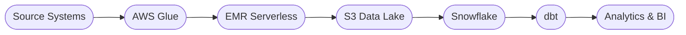

  

<h2 align="center">Building scalable data platforms, AI-powered applications, and cloud-native solutions.</h2>

Software Engineer 2 &nbsp;·&nbsp; CSAA Insurance Group

  <a href="https://www.linkedin.com/in/subash-nirmal-kolluru/">LinkedIn</a>
  &nbsp;·&nbsp;
  <a href="https://subash-nirmal-kolluru.vercel.app/">Portfolio</a>
  &nbsp;·&nbsp;
  <a href="mailto:subash.nirmal.kolluru@gmail.com">Email</a>
  &nbsp;·&nbsp;
  <a href="https://subash-nirmal-kolluru.vercel.app/">Resume</a>

 

---

## 🎯 Engineering Impact

| &nbsp;&nbsp;Data Scale&nbsp;&nbsp; | &nbsp;&nbsp;Performance&nbsp;&nbsp; | &nbsp;&nbsp;Automation&nbsp;&nbsp; | &nbsp;&nbsp;Research&nbsp;&nbsp; |
|:-----------:|:------------:|:-----------:|:---------:|
| **3 TB+ / day** | **80% Faster** | **40% Improvement** | **2 Publications** |

 

 

---

## � Featured Project &nbsp;—&nbsp; CarmaSure

> Privacy-first insurance intelligence platform built with Flutter.

| Offline Estimation | Modern Mobile UX | AI-Ready Architecture | Product-Focused |
|:-----------------:|:----------------:|:---------------------:|:---------------:|
| ✓ | ✓ | ✓ | ✓ |

<!-- Screenshot placeholder — uncomment when asset is available:

  

-->

  <a href="https://subash-nirmal-kolluru.vercel.app/">Demo</a>
  &nbsp;·&nbsp;
  <a href="https://github.com/SubashNirmal-Kolluru">Repository</a>

 

---

## 💼 Featured Work

### ☁️ Data Engineering Portfolio

Production-scale AWS and Snowflake architectures for enterprise data platforms.

`CDC Pipelines` &nbsp; `Data Modeling` &nbsp; `PySpark` &nbsp; `Terraform` &nbsp; `Airflow`

<a href="./Data-Engineering-Portfolio/">View Portfolio →</a>

---

### 🔬 One-Class SVM Research

Published anomaly detection research on early equipment failure prediction using OCSVM and Hidden Markov Models.

  <a href="https://index.ieomsociety.org/index.cfm/article/view/ID/1989">Read Paper (OCSVM) →</a>
  &nbsp;·&nbsp;
  <a href="https://index.ieomsociety.org/index.cfm/article/view/ID/1983">Read Paper (HMM) →</a>

---

### 🗄️ SimpleDB

Database engine built from scratch — query processing, storage management, and full CRUD operations.

<a href="./SDE/SimpleDB-DatabaseEngineImplementation/">View Project →</a>

---

### 🎮 Train with Arms

VR FPS training game with locomotion, health systems, and AI-driven enemies.

<a href="https://www.youtube.com/watch?v=Ic0E412q_Ms">Watch Gameplay →</a>

 

---

## 📈 Career Journey

  <code>Research</code>
  &nbsp;&nbsp;→&nbsp;&nbsp;
  <code>Machine Learning</code>
  &nbsp;&nbsp;→&nbsp;&nbsp;
  <code>Optimization & Analytics</code>
  &nbsp;&nbsp;→&nbsp;&nbsp;
  <code>Graduate Studies</code>
  &nbsp;&nbsp;→&nbsp;&nbsp;
  <code>Cloud Data Engineering</code>
  &nbsp;&nbsp;→&nbsp;&nbsp;
  <code>Product Development</code>

 

---

## 🛠️ Technical Expertise

**Data Engineering** &nbsp;&nbsp; `AWS` &nbsp; `Snowflake` &nbsp; `PySpark` &nbsp; `Airflow`

**Cloud & Infra** &nbsp;&nbsp;&nbsp;&nbsp;&nbsp;&nbsp;&nbsp; `Terraform` &nbsp; `CI/CD` &nbsp; `Lambda` &nbsp; `S3`

**Product Dev** &nbsp;&nbsp;&nbsp;&nbsp;&nbsp;&nbsp;&nbsp;&nbsp; `Flutter` &nbsp; `React` &nbsp; `REST APIs`

**AI / ML** &nbsp;&nbsp;&nbsp;&nbsp;&nbsp;&nbsp;&nbsp;&nbsp;&nbsp;&nbsp;&nbsp;&nbsp;&nbsp;&nbsp;&nbsp; `Scikit-Learn` &nbsp; `SageMaker` &nbsp; `LLMs`

 

---

## 📊 GitHub Stats

  
  &nbsp;
  
  &nbsp;
  

 

---

## 📦 Archive

<b>Machine Learning</b>

 

- **[COVID-19-Forecasting-RNN](./DS-ML/COVID-19-Forecasting-RNN/)** — RNN-based COVID case forecasting
- **[Kaggle MOA Drug Prediction](./DS-ML/Kaggle_MOA-DrugPrediction/)** — Multi-label drug mechanism classification
- **[Concrete Strength Prediction](./DS-ML/ConcreteStrengthPrediction--GradientDescent-vs-ML/)** — Gradient descent vs. scikit-learn regression comparison
- **[Fault Diagnosis using One-Class SVM](./DS-ML/Fault-Diagnosis-using-OneClassSVM/)** — Anomaly detection and prognostics

<b>Analytics</b>

 

- **[Pharmacy Analysis](./DS-ML/US-StateLevel-PharmacyAnalysis-Prediction/)** — EDA and predictive modeling of US pharmacy distribution
- **[Movie Gross Prediction](./DS-ML/Movie-Gross-Prediction/)** — Bollywood box office forecasting using web-scraped data
- **[IPL Win Prediction](./DS-ML/IPL-Win-Prediction/)** — Statistical modeling of cricket match outcomes
- **[GST Twitter Sentiment Analysis](./DS-ML/GST-Twitter-Sentiment-Analysis/)** — Pre/post-GST sentiment comparison using NLP

<b>Optimization</b>

 

- **[Capacitated Vehicle Routing + Sentiment Analysis](./DS-ML/Capacitated-Vehicle-Routing-Problem--Sentiment-Analysis/)** — Route optimization and delivery prioritization

<b>Hardware</b>

 

- **[Soundless Honking System](./DS-ML/SoundlessHonkingSystem/)** — Arduino-based non-intrusive vehicle alert system

 

---

## 🔮 Looking Ahead

- **Data Engineering Portfolio** — AWS architectures, Snowflake patterns, CDC pipelines, and Terraform modules
- **AI Assistant** — Conversational interface for exploring my experience and projects
- **Blog** — Technical deep-dives into data engineering, ML, and product development

---

  <i>Open to conversations about data engineering, cloud architecture, ML systems, and product engineering.</i>

