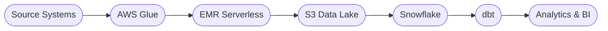

  

<h2 align="center">Building scalable data platforms, AI-powered applications, and cloud-native solutions.</h2>

Software Engineer 2 &nbsp;·&nbsp; CSAA Insurance Group

  <a href="https://www.linkedin.com/in/subash-nirmal-kolluru/">LinkedIn</a>
  &nbsp;·&nbsp;
  <a href="https://subash-nirmal-kolluru.vercel.app/">Portfolio</a>
  &nbsp;·&nbsp;
  <a href="mailto:subash.nirmal.kolluru@gmail.com">Email</a>

  <a href="https://subash-nirmal-kolluru.vercel.app/"><strong>⬇ Download Resume</strong></a>

 

··············································································

## 🎯 Engineering Impact

| &nbsp;&nbsp;Data Scale&nbsp;&nbsp; | &nbsp;&nbsp;Performance Improvement&nbsp;&nbsp; |
|:-----------:|:------------:|
| **3 TB+ / day** | **80% Faster Processing** |

| &nbsp;&nbsp;Automation Impact&nbsp;&nbsp; | &nbsp;&nbsp;Research&nbsp;&nbsp; |
|:-----------:|:---------:|
| **40% Improvement** | **2 Publications** |

 

 

··············································································

## 🔭 Current Focus

Building production-scale data platforms at CSAA Insurance Group.

`Snowflake Data Engineering` &nbsp; `AWS Glue & EMR Serverless` &nbsp; `CDC Pipelines`

`Data Modeling` &nbsp; `Metadata-Driven Automation` &nbsp; `Analytics Engineering` &nbsp; `AI-Augmented Data Platforms`

 

··············································································

## 🚗 Featured Project &nbsp;—&nbsp; CarmaSure

> Privacy-first insurance intelligence platform built with Flutter.

<!-- Screenshot — uncomment when asset is available:

  

-->

| Offline Estimation | Modern Mobile UX | AI-Ready Architecture | Product-Focused |
|:-----------------:|:----------------:|:---------------------:|:---------------:|
| ✓ | ✓ | ✓ | ✓ |

  <a href="https://subash-nirmal-kolluru.vercel.app/"><strong>View Demo →</strong></a>
  &nbsp;&nbsp;·&nbsp;&nbsp;
  <a href="https://github.com/SubashNirmal-Kolluru">Repository →</a>

 

··············································································

## 💼 Featured Work

### ☁️ Data Engineering Portfolio *(In Progress)*

Production-scale AWS and Snowflake architectures for enterprise data platforms.

`CDC Pipelines` &nbsp; `Data Modeling` &nbsp; `PySpark` &nbsp; `Terraform` &nbsp; `Airflow`

*Coming soon: AWS Architectures · Snowflake Patterns · CDC Pipelines · Terraform Modules*

<a href="./Data-Engineering-Portfolio/">View Portfolio →</a>

 

### 🔬 One-Class SVM Research

Published anomaly detection research on early equipment failure prediction using OCSVM and Hidden Markov Models.

  <a href="https://index.ieomsociety.org/index.cfm/article/view/ID/1989">Read Paper (OCSVM) →</a>
  &nbsp;·&nbsp;
  <a href="https://index.ieomsociety.org/index.cfm/article/view/ID/1983">Read Paper (HMM) →</a>

 

### 🗄️ SimpleDB

Database engine built from scratch — query processing, storage management, and full CRUD operations.

<a href="./SDE/SimpleDB-DatabaseEngineImplementation/">View Project →</a>

 

### 🎮 Train with Arms

VR FPS training game with locomotion, health systems, and AI-driven enemies.

<a href="https://www.youtube.com/watch?v=Ic0E412q_Ms">Watch Gameplay →</a>

 

··············································································

## 📈 Career Journey

  <code>2018 &nbsp; Research</code>
   ↓ 
  <code>2019 – 2021 &nbsp; Machine Learning & Analytics</code>
   ↓ 
  <code>2022 – 2023 &nbsp; Graduate Studies (MS Business Analytics, UT Dallas)</code>
   ↓ 
  <code>2023 – 2024 &nbsp; Software Engineering & Databases</code>
   ↓ 
  <code>2024 – Present &nbsp; Cloud Data Engineering @ CSAA</code>
   ↓ 
  <code>2025 &nbsp; Product Development</code>

 

··············································································

## 🛠️ Technical Expertise

**Data Engineering** &nbsp;&nbsp; `Snowflake` &nbsp; `AWS` &nbsp; `PySpark` &nbsp; `Glue` &nbsp; `EMR` &nbsp; `Airflow`

**Cloud & Infra** &nbsp;&nbsp;&nbsp;&nbsp;&nbsp;&nbsp;&nbsp; `Terraform` &nbsp; `CI/CD` &nbsp; `Lambda` &nbsp; `S3`

**Product Dev** &nbsp;&nbsp;&nbsp;&nbsp;&nbsp;&nbsp;&nbsp;&nbsp; `Flutter` &nbsp; `React` &nbsp; `REST APIs`

**AI / ML** &nbsp;&nbsp;&nbsp;&nbsp;&nbsp;&nbsp;&nbsp;&nbsp;&nbsp;&nbsp;&nbsp;&nbsp;&nbsp;&nbsp;&nbsp; `Scikit-Learn` &nbsp; `SageMaker` &nbsp; `LLMs`

 

··············································································

## 📦 Archive

<b>▶ Machine Learning</b>

 

- **[COVID-19-Forecasting-RNN](./DS-ML/COVID-19-Forecasting-RNN/)** — RNN-based COVID case forecasting
- **[Kaggle MOA Drug Prediction](./DS-ML/Kaggle_MOA-DrugPrediction/)** — Multi-label drug mechanism classification
- **[Concrete Strength Prediction](./DS-ML/ConcreteStrengthPrediction--GradientDescent-vs-ML/)** — Gradient descent vs. scikit-learn regression comparison
- **[Fault Diagnosis using One-Class SVM](./DS-ML/Fault-Diagnosis-using-OneClassSVM/)** — Anomaly detection and prognostics

<b>▶ Analytics</b>

 

- **[Pharmacy Analysis](./DS-ML/US-StateLevel-PharmacyAnalysis-Prediction/)** — EDA and predictive modeling of US pharmacy distribution
- **[Movie Gross Prediction](./DS-ML/Movie-Gross-Prediction/)** — Bollywood box office forecasting using web-scraped data
- **[IPL Win Prediction](./DS-ML/IPL-Win-Prediction/)** — Statistical modeling of cricket match outcomes
- **[GST Twitter Sentiment Analysis](./DS-ML/GST-Twitter-Sentiment-Analysis/)** — Pre/post-GST sentiment comparison using NLP

<b>▶ Optimization</b>

 

- **[Capacitated Vehicle Routing + Sentiment Analysis](./DS-ML/Capacitated-Vehicle-Routing-Problem--Sentiment-Analysis/)** — Route optimization and delivery prioritization

<b>▶ Hardware</b>

 

- **[Soundless Honking System](./DS-ML/SoundlessHonkingSystem/)** — Arduino-based non-intrusive vehicle alert system

 

··············································································

## 🔮 Looking Ahead

- **Data Engineering Portfolio** — AWS architectures, Snowflake patterns, CDC pipelines, and Terraform modules
- **AI Assistant** — Conversational interface for exploring my experience and projects
- **Blog** — Technical deep-dives into data engineering, ML, and product development

··············································································

  <i>Open to conversations about data engineering, cloud architecture, ML systems, and product engineering.</i>

